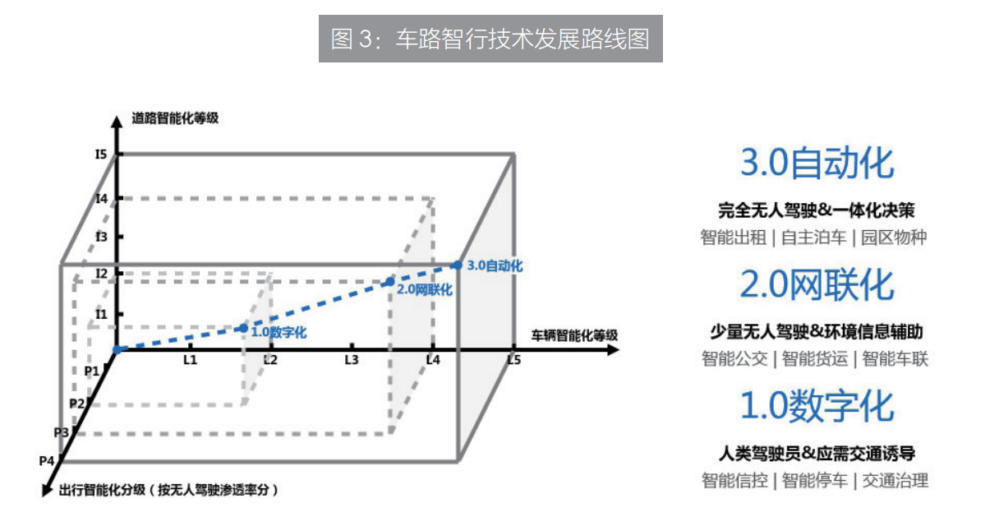

# 一、概念内涵

​	车路智行是指以车路云图为基础、以自动驾驶和车路协同等人工智能技术为引擎、以传感数据为燃料、以通信网络为纽带、以产品服务为应用的新一代智能交通融合技术,通过基础设施、运输装备与运行管控的有机结合,可综合实现基础设施布局完善、立体互联、交通装备先进适用完备可控、运输服务便捷舒适、经济高效等一体化交通功能,是对传统分散式智能交通技术的次深刻变革,是构建安全、便捷、高效、绿色、经济的现代化综合交通体系的科技支撑。

​	车路智行采用先进的自动驾驶、车路协同、无线通信和新一代互联网等技术,实现人、车路、云、图等交通要素的交互融合,由车辆智能化、道路智能化、运输智能化三个维度组成,遵循数字化、网联化、自动化三个阶段的发展路线,是可持续的交通承载形态。与传统交通相比,基于车路智行的智能交通具有高级别自动驾驶车辆、全息全量感知的新一代交通信息基础设施共享便捷的门到门出行、端到端的低成本货物运输等优势特征,因而具备更高的安全等级、出行体验、通行效率、管理水平,是典型的具备共同受益、乘数效应的“新基建”,是新时代产和消费升级的重要着力点。

# 二、主要意义

# 三、技术发展路线

​	车路智行遵循全球主流技术发展规律,沿着“数字化升级、网联化转型、自动化变革”的技术发展路径,逐步完成品牌內核锤炼与社会价值实现。其中

# 四、发展愿景

# 五、百度ACE交通引擎

作为百度智能交通的综合解决方案,百度ACE交通引擎将推动人工智能与基础设施、运输装备、运输服务、行业治理的深度融合,构建实时感知、瞬时响应、智能决策的全栈城市智交通体系,支撑我国建成最具活力的智能汽车创新生态体系和“安全、便捷、高效、绿色、经济”的现代化智能交通体系。

百度 ACE 交通引擎采用“1+2+N”的总体架构，其中：1 个数字底座，包括小度车载OS、飞桨、百度智能云、百度地图支撑的“车”“路”“云”“图”等未来交通基础设施；2个智能引擎，分别是 Apollo 自动驾驶引擎和车路协同引擎；N 个应用生态，包括智能信控、智能停车、交通治理、智能公交、智能货运、智能车联、智能出租、自主泊车和园区物种等。

百度 ACE交通引擎的数字底座搭建起“车—路—云—图”一体化融会互通的底层基础设施，智能引擎是车路行一体化得以运转的动力源泉，融合面向未来交通的人工智能、大数据以及交通业务处理的全息感知与理解、全时空推演与决策、全场景实时控制平台，构建起上下双向得以沟通服务的桥梁，应用生态服务于公安交管、交通运输、城市管理、应急管理等部门，是面向未来交通的自主、全栈、开放、可控的一体化解决案。

## 5.3 应用实践

### 1. 车路协同，面向未来、服务当下的基础设施智能方案

百度车路协同，全球唯一既服务当下交通治理，又面向未来智能驾驶的车路协同解决方案：

- 高性价比的安全保障：唯一支持全部 L2/L3/L4 智能网联车的车路协同系统，提升车辆安全，降低单车成本；
- 全面的交通信息：可获取全量交通参与者的结构化信息，提升网联辅助驾驶场景范围；
- 轻量级海量用户入口：百度地图 APP 入口可为 4 亿用户提供无门槛可触达的车路协同出行服务；
- 无感兼容升级：兼容辅助驾驶、高级别自动驾驶双标 V2X 通信标准，面向未来，也更好地服务现在。

通过整合道路侧多元感知数据，依托路侧本地边缘计算超高算力、强实时、深度学习计算特性，融合多场景语义理解、动态高精地图、边云协同框架、松耦合通信接入、亿级移动出行用户终端触达能力，满足未来交通自动驾驶车辆规模化应用、协同云控应用需求。全国 10+ 城市已开展示范应用。

### 2. 智能信控，AI 视觉 + 地图大数据交通治理工具

百度智能信控，是全球唯一的基于 AI 视觉技术和交通地图大数据构建的车路协同智能信控系统：

- 核心 AI 视频技术优势：全面深入的人、车、路、环境感知理解，提供准确、实时、精细的交通指标数据；
- 融合地图数据优势：丰富的实时路况、交通事件和交通拥堵信息，强大的交通大数据分析研判能力和交通问题诊断评估能力；
- 实时自适应优化能力：根据交通变化动态优化信号配时，即时下发配时方案，大幅提高区域范围内道路通行能力；
- 先进技术应用能力：唯一可融合 5G、自动驾驶、车路协同等先进技术的智能交通解决方案。

### 3. 智能停车，中国第一的高位视频停车解决方案

百度联合生态合作伙伴爱泊车推出的智能停车，是市场份额第一的路侧高位视频停车方案首创者：

- 基于 AI 的高位视频方案：7x24 小时无人化视频监控，节约人力；基于图像识别与机器智能的超大规模支付级应用；
- 可规模化复制的成功方案：一套方案覆盖北京全市 15 个城区 4 万 + 泊位和全国 11 个城市 8 万 + 车位；订单收费率提升至 90% 以上，投资效益显著提升；
- 连通三端的生态闭环：G 端 +B 端双轮驱动 C 端，惠及上百万车主，海量数据造就一体化、全场景、城市级智慧停车解决方案；
- 领先的行业认证：工信部认可的静态交通领域唯一的人工智能企业；2016—2017 年度最具影响力城市智慧停车企业；2017 年智慧交通三十强——智慧停车领域唯一获奖单位。

### 4. 智能公交，全球领先的智能驾驶公共出行新体验

百度智能公交，全球唯一的车辆、路线、乘客、站台和场站的全场景车路协同智能公交方案：

- 全国领先的技术方案：构建“人—车—路—云”全新智能公交出行体系；

- 全路线的车路协同能力：为公交全场景打造的车路联动方案；

- 多途径触达终端用户：通过 APP/ 电子站牌 / 车内屏提供出行信息，智能化提升乘客公共出行体验；
- 大数据运营管理平台：专为公交运营服务的云端管理服务平台，有效提升公交运营管理效率。

### 5. 智能货运，国内最智能、最安全、最高效的物流选择

百度智能货运，是结合全国最大的干线物流场景量身打造的顶尖自动驾驶物流方案：

- 最先进的车端技术：国内唯一实现自动驾驶编队行驶能力的高速物流方案，稳定安全的车端驾驶能力；
- 车路协同实践落地：参与制定国内首个高级别自动驾驶车路协同标准并率先在物流商用车场景实现落地；
- 最大规模的场景方：通过全国最大的自营干线物流车队（2400 辆）和商用车租赁服务平台（50 万 + 卡车司机）需求量身打造的方案，方案快速落地可感知。

### 6. 智能车联，规模化覆盖的智能交通终端

百度智能车联，是业内最快规模化覆盖、基建零投入、方案轻集成、用户强感知的 AI 智能车联解决方案：

- 零基建改造投入：只需接入交通实时信控等数据，闪传平台自动规划智慧交通路线，解决城市拥堵；
- 轻量级集成方案：低门槛低成本终端快速布局，协同智慧交通引擎，快速扩大城市智能车联应用范围；
- 丰富的智能车联应用：海量应用和内容带给用户驾驶体验升级和安全保障。

智能车联网系统解决方案小度车载 OS，集云、端、芯等功能于一体，结合先进的语音语义理解、视频分析及车路协同技术，为量产前装车机、CarLife 手机投屏、准前装车机以及智能后视镜等产品提供路口红绿灯通行引导、车辆碰撞预警、AR 实景导航、ADAS 辅助驾驶等服务。同时，基于小度车载 OS，构建先进的智能座舱系统，通过语音、手势等方式实现对车内中控、仪表、后视镜、HUD、空调座椅等设备的智能控制，为用户提供更加人性化的驾车体验。

### 7. 智能出租，全球首个前装量产 +L4 商业化运营

百度智能出租（Robotaxi），是中国技术最强、落地最多、体验最好、应用最广的全球首个量产级自动驾驶乘用车运营方案：

- 中国第一的技术：结合车路协同，可自如应对海量复杂城市场景，是未来智慧交通的集大成者；
- 面向量产的生产标准：中国首款量产级 L4 前装车辆，安全性 / 可靠性业界领先，兼具美观和高性能；
- 批量运营云平台：在中国最大自动驾驶运营车队中诞生的全链条云端平台，支持实时、高效的车队管理和运营服务；
- 多价值的应用场景：全面支持城市出租、移动安防、道路设备巡检、高精地图采集、交通数据采集等应用场景。

### 8. 自主泊车，软硬一体 ASIL-D 最高车规安全等级

百度自主泊车，是 ASIL-D 最高车规安全等级的 L4 级自主泊车解决方案：

- 业界最高车规安全等级：中国第一个 L4 级量产乘用车自主泊车产品；

- 适用多种停车场类型：公共停车场，配合基建改造实现全无人自主泊车取车；小区停车场，无需改造一次性 AI 训练实现安全泊车；

- 智能泊车管理：城市级“车—云—图—场”管理，通过 AI 云端计算监控训练最大幅度实现停车场自动化调度运营，优化市民停车体验。

自主泊车系统采用“车端改造“和“车端＋场端改造”两种技术路线，实时提供自车 6D坐标、云端全局调度、高精度地图更新、增强性感知等能力，具备多种停车场景适应性。百度员工已经在百度多个办公区间已经实现最后一公里自主泊车。2020 年威马汽车搭载 L4 级自主泊车车型即将面世。

### 9. 园区物种，全球最全场景可量产的自动驾驶产品集

百度园区级自动驾驶新物种，是中国能力最全面、场景最多变、产品最丰富的一站式园区自动驾驶方案 / 产品集群：

- 园区无人小巴：全球首款量产级无人小巴，落地范围最广，触达人群最多；

- 园区服务车辆：赋能多种服务型无人车，涉及园区所需的快递、外卖、零售、安防、防疫、运输等业务，全球落地超过 1000 辆；
- 覆盖广泛场景：工业 / 科技园区、景区、新城、生活社区、机场、酒店 / 度假村等；
- 全面领先的开放平台：包含业界领先的自动驾驶方案、业务接口、量产工具组件、安全保障体系、运营售后方案。

# 总结

## ( 一 ) 攻克车路智行关键技术

车辆智能化。重点突破 L3、L4 级自动驾驶技术，实现典型道路场景下的安全运行。重点突破适用于高自动驾驶渗透率、全工况交通场景下的自动驾驶技术，完善复杂系统体系架构，形成中国标准体系下的高度自动驾驶技术创新体系。

道路智能化。重点突破车路协同、智能信控、边缘计算、无线通信等核心技术，达到低延迟、实时感知交互能力。重点突破全域全息感知技术、人车路云一体化决策控制技术、毫米级地图与定位技术，为行人、物资提供全方位信息护航。

运输智能化。重点突破“门到门”的无障碍出行服务技术、一键式预约全栈式出行、自动驾驶共享出行、公交优先出行、应急出行，实现全天候自动驾驶运输。结合泛在先进的智能车辆及交通信息设施，让交通运输享受“零事故、零拥堵、零等待、零鸿沟”四个“零”的新体验。

## ( 二 ) 打造车路智行核心引擎

数字底座。重点建设利旧衔接、面向未来的车路协同、边缘计算、智能信控、智能停车、高精地图、雷达相机、5G 等新一代智能交通信息基础设施，形成“车—路—云—图”的数字化底座（即车路智行 IaaS），建成全国一体化交通控制网。

平台引擎。基于深度学习、车路协同、自动驾驶等算法，汇集道路、车辆、政府、互联网、第三方等海量数据，打造“全息感知与理解、全时空推演与决策、全场景实时管控”的 AI引擎（即车路智行 PaaS），形成兼容底座和应用的中台。

交通应用。遵循车路智行的技术发展路线，结合车路智行新基建的逐步覆盖，推进智能信控、智能停车、交通治理、智能公交、智能货运、智能车联、Robotaxi、自主泊车、园区物种新等应用，实现“智能交通”。

## ( 三 ) 赋能车路智行运营模式

赋能城市智能交通运营商。鼓励有条件的地方先行先试，探索城市智能交通运营商新模式，在有机融合新一代交通信息基础设施网与运输服务网、能源网的基础上，统筹推进“一揽子”智能交通建设，实现高水平交通运输公共服务，打造产业生态开放平台，实现政府投资价值和系统价值的最大化。

助力治理体系和治理能力现代化。通过平台式的运营模式，能够打通数据壁垒，统筹全域、全量、全时的交通大数据，实现各部门之间的数据共享与数据交换，实现数据资源的互联互通。为城市智能交通信息归集的最大化、交通分析研判的科学化、交通组织管理的智能化、交通指挥调度的精准化和交通综合治理的一体化提供支撑。

人工智能和交通强国的号角已经吹响，宏伟蓝图已经绘就。百度致力于成为实现交通强国的 AI引领者，将以无愧于时代的作为，以“自动驾驶国家新一代人工智能开放创新平台”为抓手，以“用科技让复杂的世界更简单”为使命，以提供“AI 交通引擎”为目标，争当智能交通高质量发展的头雁，助力实现交通服务的现代化、精准化和便捷化，不断谱写智能交通、智能经济与智能社会的新篇章。