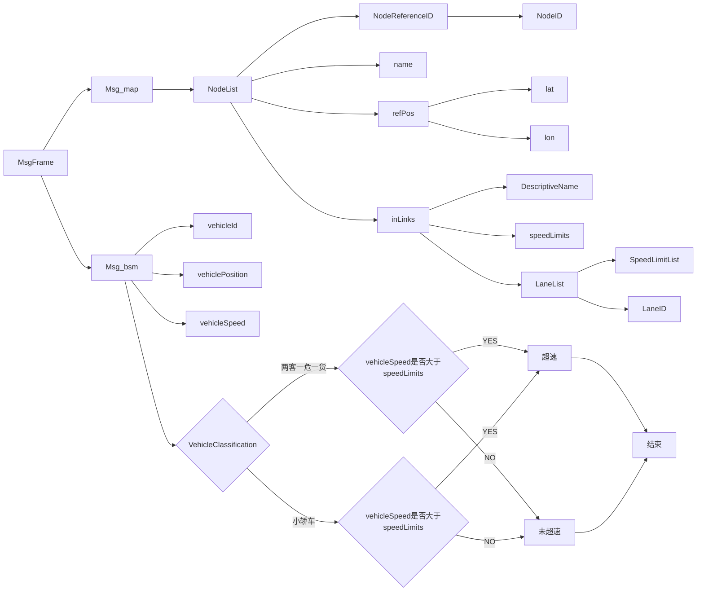
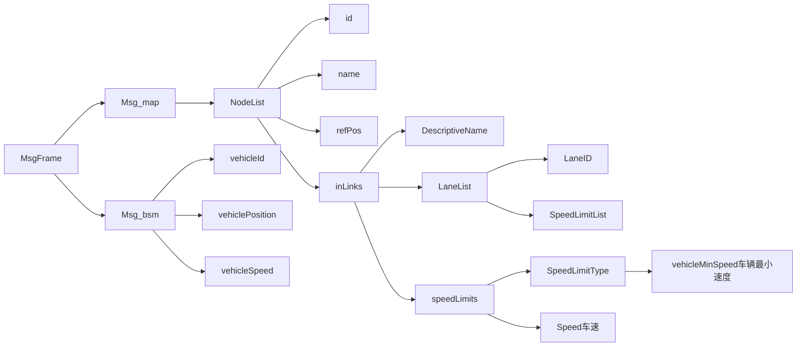
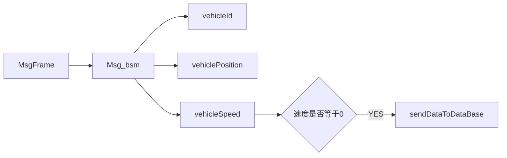
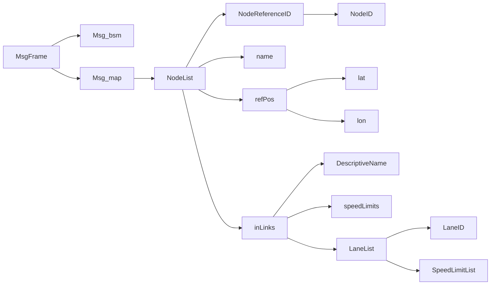
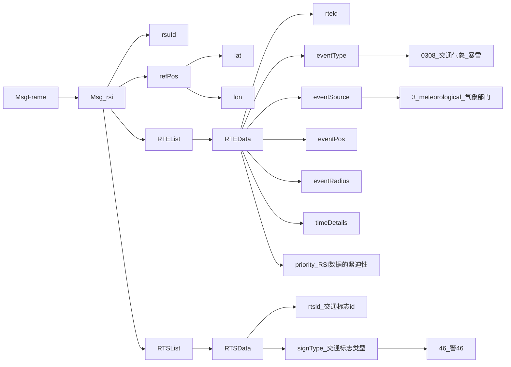
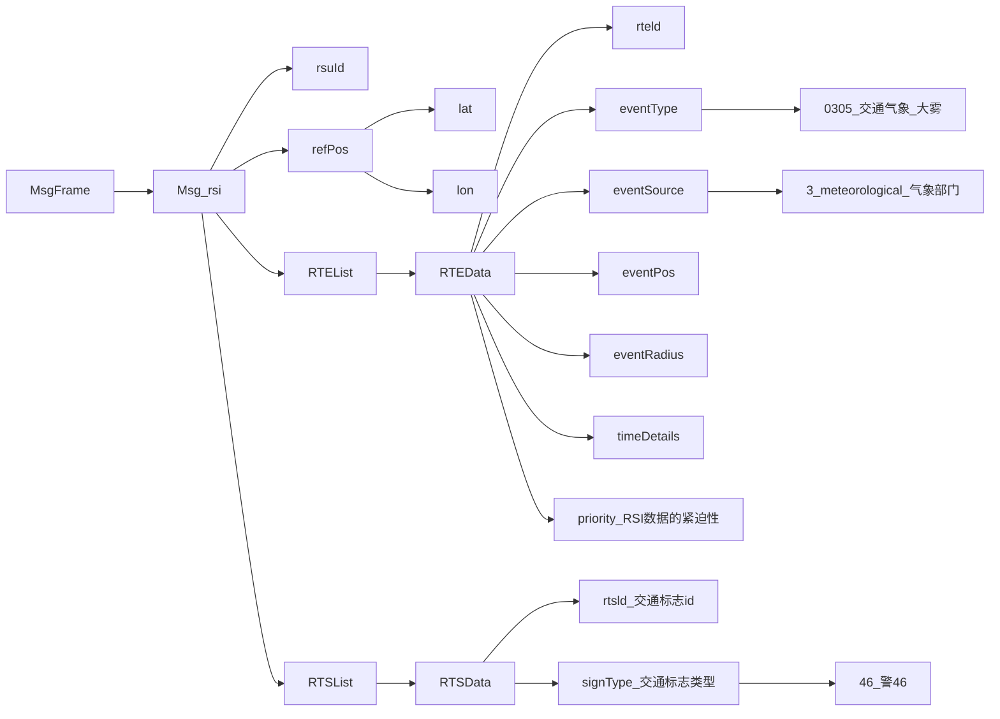
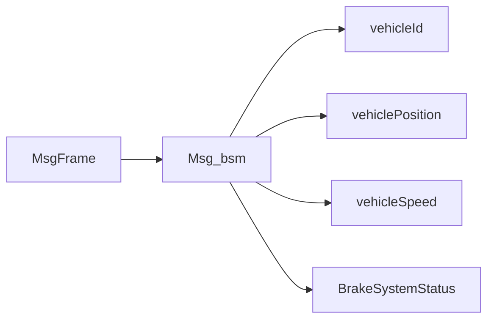

# 车路协同高速公路建设的思考与实践

## 车路协同高速公路建设思考

目前智慧高速的系统中中已包括了养护、路政、巡查、稽查、收费、监控、应急管理等等业务。<font color='red'>对于车路协同来说，不是另建一套系统进行交通管理，而是作为一个补充融入到原有系统中，解决原有技术解决不了的问题。</font>

比如，原有交通数据采集中已包括了大量的视频、线圈、微波测速、浮动车、互联网的数据，<font color='blue'>车路协同技术可以增加车载终端提供的GPS、紧急故障、驾驶意图等数据，可以增加以交通参与者目标为粒度的感知覆盖面和精细度</font>；另外，以往的交通诱导、道路状况、收费信息等的发布对象是无差别的，而<font color='blue'>通过车路协同技术可以差异化地精准到车；再如，柔性车道的控制，从面向驾驶员的可变指示牌，通过车路协同技术，可以转变为面向自动驾驶车辆和智能网联车辆的精准指引。</font>

但是，车路协同技术并不会改变整体交通管理的业务逻辑。原有交通管理系统的形成是经过不断演进变化的，不是一蹴而就的，是错综复杂的系统。车路协同作为新技术，对原有系统的数据来源、控制方法、发布方式进行补充，并融入到实际业务系统中。

那么对于车路协同，如何在测试基地或示范省份快速进行落地实践呢？是先实现智能车还是智慧路呢？

当前阶段应当先建设“智慧的路”，推动LTE-V2X+路侧感知等基础设施建设，**并要求两客一危一货、养护车、巡查车、路政车、应急车辆等运营车辆安装智能车载终端OBU，让运营车辆先跑起来**；随后积极开展自动驾驶试验，有条件的推动特定环境下各种车辆的中低速无人驾驶，积累经验，逐步推广扩大车路协同方案的落地实践。

<font color='red'>通过车路协同，提高原有系统的效能，才是最有商业实现价值的。</font>

## 车路协同高速公路建设实践

在车端，通过集成C-V2X通信功能、高精度定位功能，为车辆提供车路协同感知融合、决策建议以及人机交互界面；

在路侧，可以集成感知、计算、通信功能，打造新型基础设施数字化底座；

在云端，可以实现数据汇聚、存储，边云协同，为上层应用提供丰富的数据支撑。

智慧高速的建设可以根据服务目标不同采取分级服务策略。为了更好的服务终端用户，可以采用C端分级触达方式：

<font color='red'>对于装有C-V2X  OBU的车辆，可以提供毫秒级服务，例如前向碰撞预警、紧急制动预警、合流区碰撞预警等等；</font>

<font color='red'>对于没有C-V2X  OBU的车辆，可以通过在路侧部署可变情报板的方式提供秒级服务，例如隧道内异常情况通知；</font>

<font color='red'>此外，还可以跟传统的导航服务相结合，在导航APP上增加分钟级动态信息服务。</font>

道路基础设施的选型上也要充分考虑道路的主要服务对象，提供不同能力等级的建设方案：

<font color='red'>对于辅助驾驶场景来说，只需要提供中低精度的信息服务；</font>

<font color='red'>对于自动驾驶场景来说，则需要提供高精度的信息服务，不管是位置精度还是准召率，都要有更高的要求。</font>

因此，不同服务等级的建设方案在设备选型上会有很大差异，需要针对目标合理配置。

**云控平台建设技术要求：**

1. 应具备接入高速公路全线交通数据的能力，并具备升级为区域云控平台的能力，同时应能够接入公安、消防、气象等多源外部数据。

2. 应具备对海量数据进行存储和复杂任务计算处理能力、统一的运行监测和综合管理能力，以及为用户提供伴随式精准信息服务的能力。

3. 应具有对高速分合流区域、交通事件多发路段以及全线不同层级交通运行精准管理和控制能力，时延应为分钟级。
4. 车路协同云控平台应实现全路网车辆的实时运行状态 知和服务，并对RSU等车路协同系统相关设备进行监控管理，对路网监测、安全应急、养护管理等方面的业务提供支撑。

# 智慧高速公路车路协同系统框架及要求

## 1.1 系统架构

### 1.1.1 整体架构

车路协同系统架构示例见图 1，应包括<font color='red'>车载终端、路侧设备、通信网络、应用平台</font> 4 个层级，各层级之间的通信接口种类应符合附录 A 的规定。


### 1.1.2 车载终端

车载终端包括但不限于<font color='red'>OBU、T-Box、辅助驾驶终端、自动驾驶终端、营运车辆智能终端、导航终端等终端单元或设备</font>。

### 1.1.3 路侧设备

路侧设备可分为以下几类：

a) <font color='red'>路侧计算设备：部署在道路沿线，配合其他系统完成交通信息处理与决策的计算设备，包括MEC、数据处理单元等。</font>

b) <font color='red'>路侧通信设备：与车载终端进行无线通信的设备，包括支持V2I通信的RSU、支持V2N的通信基站等。</font>

c)<font color='red'> 路侧感知设备：交通环境和道路交通状态的感知设备，包括摄像机、毫米波雷达、激光雷达等。</font>

光纤传感器、RFID标签等桥梁、隧道、边坡等基础设施的运行状态和安全的感知设备，以及检测能见度、温度、湿度、风、路面湿滑状态等气象信息的环境监控设施感知到的信息，可通过基础设施数据接口发送给车路协同系统。

d) <font color='red'>电子标志标线：数字化路侧标志牌、情报板，以及可穿越冰雪、雨水、尘土的车道标志设备等。</font>

### 1.1.4 通信网络

通信网络主要包括：

a) 光纤、以太网等有线网络。

b) LTE、LTE-V2X、NR-V2X、4G/5G蜂窝网、DSRC、物联网（NB-IOT）等无线通信网络。

### 1.1.5 应用平台

应用平台汇聚道路的<font color='red'>交通状态信息、车辆状态信息、路侧设备状态信息，并提供道路交通运营管理、运维和车路协同业务服务。</font>

根据路网规模和管理需求，应用平台可采用中心云和区域云两级设置，或者只设置一个中心云平台。

<font color='red'>中心云平台接入所有路侧设备和车载终端的数据并进行集中处理</font>。

<font color='red'>区域云主要实现本地车路协同调度和时延敏感业务的处理。</font>

### 1.1.6 车路协同基础设施应用

根据初步建成的路侧感知设备，搭建管控、调度、服务平台，为道路使用者提供车道级导航、无停留收费、前方事故预警、抛洒物预警、特殊车辆避让、匠道口预警、气象环境推送、标志标牌信息数字化发布等车路协同功能。

车路协同基础设施架构如图1所示。


自定义路侧设备类型：<font color='red'>定义各种路侧设备的能力，包括路侧单元、视频检测器、雷达检测器、交通电子标志、交通信号机等的设备属性，为路侧设备提供统一的设备模型、发放、认证、注册鉴权、设备升级、配置、数据订阅、命令、数据存储归档服务等，确保合法设备的相互通信及信息安全。</font>

支持多种路侧设备的管理：<font color='red'>支持智能路侧单元、视频检测器、雷达检测器、交通电子标志、交通信号机等路侧设备的接入，接收到路侧设备上报的数据后，平台计算可能存在的风险，并向车辆下发预警信息或调度指令</font>。

实现基础设施的智能化管控：<font color='red'>提供大容量多类别的设备认证、接入、管理、状态监控功能；管控车路协同传感系统、路侧设备，服务智能网联汽车运行</font>。

提供开放的开发接口服务：<font color='red'>与交通和交管部门的平台实现互联互通，开放数据接口，接入道路管理系统、交通信号管理系统、实时路况、视频监控、高精度地图等交通信息，并提供API访问接口</font>。

支持V2X应用信息交互：<font color='red'>闯红灯预警、基于信号灯的车速引导、道路危险状况提示、超速告警、限速预警、交叉路口碰撞预警、行人盲区预警/电单车出没预警、匠道车辆汇入预警、车内标牌等。</font>

传统智能交通系统是依托中心云平台，在前端实时采集数据，通过有线/无线网络上传至云端，在云端上进行计算、分析，并将结果发布至智能路侧单元和移动终端上，实现云端和终端设备的协调控制。但随着车路协同技术的发展，智能终端产生海量的实时数据需要处理，车辆行驶安全服务需要毫秒级延时，以便通知驾驶员或控制车辆采取措施。

边缘计算，它可以将云端的计算能力移动到边缘层，在边缘设备上完成绝大部分的计算，并通过智能路侧单元等传输手段，实时将结果发送给装置车载单元的车辆，满足车路协同的低延迟需要。

## 1.2 功能要求

### 1.2.1 车载终端

集 成 C-V2X、2G/3G/4G、GNSS、 以太网、CAN、WIFI 等通信方式，支持车 - 路、车 - 车信息实时交互，支持车辆信息 OBD监控与诊断、主要功能如下 :

- 通过 CAN 总线获取自<font color='red'>车辆行驶数据，包括当前车速、行驶方向等；</font>

- 通过<font color='red'> V2X 通信方式向路侧设备或附近其他车辆发送自车当前行驶状态数据；</font>

- 通过<font color='red'> V2X 通信方式从路侧设备或附近其他车辆获取周边各交通元素的信息，包括行驶方向、速度、距离等；</font>

- <font color='red'>接收路侧设备发送的交通信号、交通管理的信息，达到危险预警、安全高效驾驶的目的。</font>

#### 1.2.1.1 数据采集

<font color='red'>车载终端应支持车辆号牌、号牌种类、车辆类型、车辆品牌、位置等信息采集功能，宜支持速度、加速度、方向角等信息采集功能。</font>

#### 1.2.1.2 通信

<font color='red'>车载终端应支持单播和广播方式与路侧设备、区域云平台、中心云平台的通信功能，宜支持与其他车辆的车载终端通信的功能。</font>

### 1.2.2 路侧设备

路侧设备主要包括：<font color='red'>路侧边缘计算设备 MEC、路侧通信设备 RSU、路侧感知设备、定位设备和电子标志标线。</font>

路侧通信设备 RSU 集成 LTE-V2X 通信技术，提供路与车、路与人、路与云平台之间全方位、低延时的连接能力。

<font color='red'>将来自 MEC 或者应用平台的路况信息、预警信息、诱导信息共享给智能网联汽车，提升车辆的感知范围，提供超视距的路况感知能力，从而提升车辆行驶的安全性，促进自动驾驶发展，提高交通效率。</font>

<font color='red'>RSU 不只是一个单纯的路边通信设备，还支持路侧交通基础设施数据（传统智能交通设施、新型智能路侧感知设备、路侧边缘计算单元等）和道路交通参与者数据的收集，包括通过有线或无线收集路侧交通设备数据、通过 PC5 接收车辆数据和弱势交通参与者数据、通过 Uu 或光纤接收应用平台下发数据等。</font>

<font color='red'>RSU 与各类传统智能交通设施（交通信号灯、摄像头、微波检测器、可变信息板等）进行对接，将传统智能交通设施进行网联化，并能够基于边缘计算架构，接入地基差分、气象服务等新型交通信息源，从而提供覆盖行车安全、效率、信息服务等全方位的路侧智能网联服务。</font>

由于 RSU 收集的数据类型复杂多样，为保证数据的正确接收和解析，RSU 支持数据的协议转换，转换后的数据格式满足国标 T/CSAE 53-2017《合作式智能交通系统车用通信系统应用层及应用数据交互标准》的要求。此外，<font color='red'>RSU 还具备定位、时钟同步、设备认证等功能</font>。

通过 RSU 技术，实现了现有智能交通设施的网联化，也利用现有的交通检测设施，拓展了车路协同系统本身的感知能力。

### 1.2.3 路侧边缘计算设备

<font color='red'>路侧边缘计算设备 MEC 接收来自路侧感知设备的信息，对交通态势、交通事件、交通参与者等信息进行检测、识别、跟踪 , 并结合来自车载终端、区域MEC 和应用平台等的多源信息进行一体化融合，进一步形成路况信息、预警信息 ,再通过 RSU 将这些信息共享给智能网联汽车进行融合决策，提升车辆的感知范围，提供超视距路况感知能力和区域交通态势感知能力，有效弥补单车智能的感知盲点，提升车辆行驶的安全性和道路通行效率，助力自动驾驶规模化商用。</font>

将 C-V2X 业务部署在路侧边缘计算单元上，使部分计算功能下沉到移动接入网边缘侧，对路段感知信息进行融合，可以减少信息处理、传输时延，降低核心网的计算负荷及海量数据回传造成的网络负荷，让汽车自动驾驶系统反应速度更快、操纵精度更准确，提高自动驾驶的安全性。可根据需要灵活配置网络中 MEC 设备的层级数目，部署多级 MEC设备，以提高系统的灵活性，有助于提供具备本地特色的高质量服务。

### 1.2.4 路侧感知设备

路侧感知设备包括：摄像机、毫米波雷达、激光雷达等监测道路交通环境中的交通参与者的状态和道路状况的交通状态感知设备，光纤传感器、RFID 标签等监控检测桥梁、隧道、边坡等道路安全状态感知设备，以及监测机电设施分布和运行状态的基础设施感知设备，还有检测能见度、温度、湿度、风、路面湿滑状态等气象环境信息的气象环境监控设施等。

定位设备由若干基准站构成，能够采集常见 GNSS 导航信号的载噪比、码伪距、载波相位、多普勒频移、导航电文数据，为智能网联车辆提供其所需的定位信息。

电子标志线包括数字化路侧标志牌、情报板，以及可穿越冰雪、雨水、尘土的车道标志设备等。

通信网络包括光纤、以太网等有线网络， 以 及 LTE、4G、5G、LTE-V2X、NRV2X、物联网等无线通信网络。

应用平台汇聚道路的交通状态信息、设备状态信息，并提供道路交通运营管理和应用服务。

根据路网规模和管理需求，应用平台可采用中心云和区域云两级设置，或者只设置一个中心云平台。

区域云主要进行本地车路协同调度和时延敏感的业务处理。

<font color='red'>应用平台具备提供管理区域的道路的交通状态信息和管控信息、道路设施信息、车路协同信息以及车辆 TSP 服务信息，支持交通状态分析、V2X 服务、交通管控服务。可根据交通状态信息，生成交通事故、交通拥堵、自然灾害等预警信息，为运营方和交通管理部门发布限速、预警、事故提醒等信息提供决策依据，并支持通过无线电广播、有线和无线网络、交通信息发布设施、手机应用（APP）、车载智能终端等形式进行交通状态信息发布。</font>

<font color='red'>应用平台还可基于统一的第三方服务应用接口为 ITS 系统、交通管理系统、车企平台、地图导航应用、出行服务应用等提供数据服务和应用服务。</font>

#### 1.2.4.1 信息感知

具有信息感知的路侧设备功能宜符合表 1 的规定。


#### 1.2.4.2 事件分析

事件分析可由单一路侧设备通过感知数据独立分析，也可以由 MEC 等接收多个路侧设备的感知数据后进行综合分析，分析功能要求如下：

a) 应支持<font color='red'>道路阻断、交通事故、交通拥堵等事件的监测和识别。</font>

b) 应支持行人闯入 非机动车闯入、抛撒物、火灾、爆炸等事件的监测和识别。

c) 宜支持<font color='red'>车辆变道、超速、不规范停车、异常行驶、倒车、逆行等事件的监测和识别。</font>

d) 宜支持交通信息的计算和分析，包括<font color='red'>交通流量、平均车速（断面车速、区间车速）、空间占有率、时间占有率、车头时距、车头间距、排队长度等。</font>

#### 1.2.4.3 通信

路侧设备的通信功能要求如下：

a) RSU应支持广播传输方式与车辆进行直连链路短程通信。

b) RSU应支持通过有线或蜂窝网络与车路协同应用平台通信。

c) MEC应支持通过有线网络与车路协同应用平台通信，同时支持与本地路侧传感器的有线通信。

#### 1.2.4.4 远程控制

摄像机、MEC、RSU 等路侧设备应支持远程软件版本更新和算法更新功能。

### 1.2.5 外场感知设备

外场感知设备包括车路协同路侧设备和车载设备，车载设备不在本项目设计范围中。

车路协同路侧设备基于全量、连续环境信息，依托边缘计算及 AI 技术，准确识别路网交通状态、事件、车辆等信息，提供数据采集、融合、预处理、分发等基本功能，实现对自动驾驶车辆、V2X 网联车的安全辅助与效率引导支持。

车路协同<font color='red'>智能路侧设备主要由传感器（摄像机和毫米波雷达）、计算单元（ECU）、 V2X 通信机（RSU）3 部分组成</font>，并根据应用及部署需要，配备机箱、接入交换机、硬盘录像机等设备。

路侧系统以 ECU、RSU 设备为核心，通过整合第三方设备数据，实现路侧设备综合管理，并实现车载系统交换数据。RSU 可通过以太网接口或串口接入摄像机、地磁车检器、微波车检器等第三方设备；同时，可通过光纤或无线网络接入云控平台，实时上传路侧设备数据和设备工况，下发交通事件信息。

## 1.3 应用平台

### 1.3.1 数据采集

应用平台应采集所属路段的车载终端和路侧设备的上传数据，并可接收第三方提供 数据，主要数据类型应包括但不限于表 2 的内容。


### 1.3.2 通信

a) 应用平台应支持采用蜂窝通信方式与路侧设备和车载终端通信，以及经 RSU 的 LTE-PC5 向车载终端广播通信。

b) 应用平台应支持与第三方服务方进行有线或者无线通信。

通信网络为本系统提供信息采集、信息发布和互联互通的通信基础条件。

涉及的通信网络建设内容包括有线光纤网络和无线网络两部分。

一方面充分复用已有 OTN/PTN 环形骨干网，实现远距离、高可靠、多方式的数据传输；

另一方面基于多种无线通信融合（LTE-V/5G 等），实现外场设备采集数据的传输和 V2X 通信管理，并满足云控平台及边缘计算对于智能网联汽车的低时延、高带宽、大接入的需求。

### 1.3.3 通用系统服务

应用平台应具备基本的数据中心服务功能，其通用系统服务包括：

a) 数据存储：支持多源数据的提取、清洗、关联、比对、标识、分发功能，可按照应用需求形成不同的主题数据库，支持数据分级分类的机制以及数据使用的优先级策略。

b) 信息处理：将来自路侧设备、车载终端和第三方的数据信息进行即时处理，生成预警和报警信息，根据应用需求发给车载终端、路侧设备或者第三方。

c) 数据接口：支持与车载终端、路侧设备和第三方接入的有线或者无线数据接口。

d) 信息安全管理：可支持基于CA证书、注册证书的信息安全认证功能，以及漏洞扫描、流量监控、进程监控、安全设置等基本安全防护要求

e) 人机界面：应支持人机交互界面，宜支持场景呈现服务。

f) 设备管理：应支持对接入的路侧设备，如RSU、MEC、摄像机、微波雷达的状态监控、版本升级功能。

g) 配置管理：包括事件管理、设备管理、地图管理服务等。

### 1.3.4 应用服务

应用平台应具备提供管理区域的道路的交通状态信息和管控信息、道路设施信息、车路协同信息以及车辆 TSP 服务信息，支持交通状态分析、V2X 服务、交通管控服务能力。主要功能包括：

a) 交通信息分析析不同类型的数据内容，生成交通事故、交通拥堵、自然灾害等预警信息，为运营放和交通管理部门发布限速、预警、事故提醒等信息提供决策依据。

b) 信息发布：支持通过无线电广播、有线和无线网络、手机应用（APP）、车载智能终端等形式的交通状态信息发布。

c) 对外服务应用接口：基于统一的第三方服务应用接口，为ITS系统、交通管理系统、车企平台、地图导航应用、出行服务应用等提供数据服务和应用服务。

d) 应用算法服务：应支持为第三方应用开发者提供应用托管和开发接口服务，包括算法管理（创建、训练、发布）、训练数据管理、模型构建引擎等，支持车路协同应用算法集中训练、一体化部署等功能。应用算法包括：目标分类、目标跟踪、危险检测、危险决策预警、自动标定、多传感器数据融合等。

### 1.3.5 IT 基础设施平台（IaaS）

IT 基础设施平台包括物理资源平台和云管理服务平台（IaaS）。

物理资源平台包括部署、运行和管理业务应用系统和大数据应用平台所需的主机、存储、网络和安全等硬件设备资源。

云管理服务平台（IaaS）主要包括云管理服务平台、云服务门户以及运维管理平台，负责主机、存储、网络和安全等物理资源的虚拟化管理，实现计算、存储、网络等物理资源的软件定义，为业务应用系统提供虚拟资源池和相关的管理服务， 实现物理资源的自动化分配、回收、监控和统一管理，降低 IT 基础设施的能耗和使用成本，提高 IT 基础设施的使用效率和灵活性。

云管理服务平台也支持物理资源的直接管理，可以实现物理资源与虚拟化资源的统一管理，能够实现所有资源的池化，资源能够通过服务的形式分配给最终使用单位，为不同的信息系统提供个性化服务。

### 1.3.6 应用支撑平台（PaaS）

应用支撑平台主要包括用户（开发者）创建、开发、测试、部署和运行业务应用系统和大数据分析与应用系统所需的开发工具链（包括集成开发环境、系统测试工具、版本控制工具、缺陷管理工具、项目管理工具等相关工具）、中间件（应用服务器、消息队列等中间件）、应用程序框架、运行时库和数据库等开发、测试工具和部署、运行环境。

云应用支撑平台的应用系统基础框架（SOA 基础组件）和应用开发工具链可以为业务应用系统开发提供支持。

其中，应用开发工具链应包括支持桌面程序、网页程序（Web App）和移动应用（Mobile App）开发的集成开发环境和软件测试等配套工具，以及协同开发管理平台。通过配备统一的集成开发环境和配套工具，可以实现业务应用系统代码级的一致性和兼容性，为规范开发过程、提高开发效率和后续升级维护以及应用系统集成提供便利和可能。通过配备协同开发管理平台，可以实现多个团队的协同开发和统一管理，帮助项目业主更好地管理项目开发过程和成果， 可以实现软件资产的集中管理，保证项目业主的软件资产安全。

### 1.3.7 业务应用和大数据分析云控平台（SaaS）

业务应用平台将为各类用户提供自动驾驶测试、公众出行、自动驾驶与网络车辆测试 3 大类服务。业务应用平台建设还包括业务信息资源和业务应用接口的开发和使用。

大数据应用平台建设包括数据在线分析、数据离线分析、视频图像分析、预测预警、运营决策支持和公众信息服务等大数据应用系统开发和部署，以及数据采集处理、数据存储管理、基础数据管理和统一信息门户等大数据应用平台基本功能的开发和部署。大数据应用平台建设还包括大数据资源库和大数据应用接口的开发和使用。

统一信息门户为云控平台用户提供统一的访问入口，实现应用访问的单点登录、各类信息的发布展现，以及数据分析、预测预警、决策支持和公众服务等功能。统一信息门户提供网站客户端（Web）和移动客户端（App），支持互联网和移动互联网使用方式。

### 1.3.8 平台共用系统建设

为了降低系统的使用复杂度，实现资源共享、互联互通和统一管理，需要建设用户认证中心、路网监控视频平台、数据采集交换平台、安全接入平台等平台共用系统。

用户认证中心为云控平台的所有应用系统和用户提供单点登录、统一认证授权和统一用户管理，方便用户使用和应用集成。

数据采集交换平台为云控平台的所有应用系统和用户提供数据和信息交换、共享的机制、管道和平台，实现应用系统之间、用户之间的数据和信息的交换、共享， 避免信息孤岛现象和信息不对称、不一致情况的发生。路网监控视频平台为云控平台的所有应用系统和用户提供路网监控视频的接入、多路切换和视频播放等常用流媒体功能。安全接入平台为云控平台以及外部系统提供信息安全保障。

## 1.4 功能分级

根据道路条件、路侧设备和车载终端的功能要求，智慧高速公路车路协同系统可分为不同等级，作为系统建设和升级的参考，分级应符合附录 B 的规定。

根据智慧高速车路协同系统能提供的功能和性能水平，进行智能化程度分级，分级定义应符 表B.1的规定，其中每一级都是在前一级基础上的增强配置和应用服务升级。

### 1.4.1 智慧高速车路协同分级说明


其中，3级以上的智慧高速公路车路协同系统具备多元数据融合感知能力，支持设备接入、数据分析、事件转发，提供低时延、高带宽和高可靠性的车路协同业务，所支持的典型应用场景应包括但不限于表B.2的内容。

### 1.4.2 高速公路典型应用场景


## 1.5 V2X应用场景设计

### 1.5.1 交通标志数字化发布

交通标志摆脱实体的束缚，以数字化的形态存在于道路交通环境中。

每一块标志都会有一个唯一的身份识别码（类似人的身份证号码）,通过无线广播的方式向道路上行驶的车辆发送识别码，车载设备通过解码获取标志的内容，从而采取相应的措施。同时可以拓展标线数字化、信号数字化、护栏数字化等，从而构建一个数字化的道路交通环境，基于此来实现车路协同。

### 1.5.2 气象环境监测与车速引导

<font color='red'>依托高速部分路段的气象监测站，将检测到的环境条件（如雨、团雾、沙尘）气象信息上报V2X平台，按照事先设定的原则变换限速值，同时将变化的限速值通过APP或者OBU发送给车辆，结合已有的视频监控分析部分路段车流量情况，通过可变限速标牌、信息提示屏等，对车辆进行车速引导。</font>

### 1.5.3 道路危险状况提醒

交通管理部门对特定路段进行道路危险状况事件下发，<font color='red'>包括：道路施工、大雾、雨雪、滑坡等。当车辆行驶至事件推送范围内路段，智能路侧单元对车辆进行预警，提醒驾驶员谨慎驾驶。</font>
<font color='red'>限速提醒/超速告警：交通管理部门对特定路段进行限速下发，当车辆行驶过程中，超出该路段限定速度，智能路侧单元对车辆进行预警，提醒驾驶员减速行驶，适用于普通道路及高速公路等有限速的道路。</font>

### 1.5.4 匠道车辆汇入预警

<font color='red'>车辆在高架或高速道路上正常行驶并接近匠道时，智能路侧单元将闸道汇入的车辆信息发送给直行车辆终端，对直行车辆驾驶员进行提醒，避免碰撞事故的发生。</font>

### 1.5.5 事故区域警示

<font color='red'>当事故发生后，由事故车辆、经过车辆的车载设备、临时警示交通标志、高速安全监控等多种数据来源向V2X车路协同平台上报事故精确地点、占用车道等事故信息，联系救援中心，并通过路侧设备（RSU)向后方来车广播推送事故信息，避免损失的扩大。</font>

### 1.5.6 车辆故障上报

结合车载设备，在故障发生时自动上报车辆故障信息和位置信息等，为故障车辆提供汽车维修和拖车服务，通过V2X车路协同平台传输至智能路侧单元，同步向周围车辆广播前方车辆故障，避免二次险情。

### 1.5.7 道路养护提示

结合高精度定位、一键事件上报、警示安全锥桶、警示三角牌等，通过对传统的交通安全设施进行物联网化改造，并与APP数据平台无缝对接，实现道路施工和封闭管制信息的实时精准采集和发布，提升用户出行效率和安全水平。

## 1.6 高速公路场景


## 1.7 提供的服务类型

（1）运营管理类服务。

<font color='red'>车路协同路侧单元获取区域内所有车辆（均为网联车辆或自动驾驶车辆）的运行信息后，根据道路上各车道车辆的运行信息生成各车行驶策略，并通过车路交互将行驶指令下发至车辆，车辆按照道路引导策略进行行驶，行驶决策权由车转向路。</font>

（2）公众出行类服务。

<font color='red'>通过 V2X 技术、情报板、手机App 等方式将已知或系统采集的信息告知车辆驾乘人员，提醒驾乘人员注意道路和交通状况，如：隧道、桥梁、连续弯道、急弯、事故易发路段以及道路施工提醒，救护车、消防车等特殊车辆提醒，道路危险状况提醒等。</font>

（3）车辆测试类服务。

高速公路上侧重于综合类场景测试，包括：级自动驾驶功能测试、ADAS 功能测试、V2X 网联辅助和 V2X 车路协同自动驾驶测试 4 个方面。


# 二、高速公路车路协同应用场景分析

## 2.1 高速公路应用场景分析

根据交警部门统计分析，高速公路有50%的事故发生在匝道，主要有以下5种类型，临近匝道停车，观察路牌；猛打方向，突然变道；临近匝道强行变道超车；匝道内行驶速度较快；错过匝道高速倒车灯。

1、安全保障类应用：隧道及隧道群、桥隧相接段、长大纵坡段、小半径曲线段、互通分合流区（尤其是分流区）、服务区出入口、高边坡路段等以及恶劣气象突发情况、交通事件下的交通安全保障应用场景。

2、效率提升类应用：自由流收费、货车编队驾驶、大交通流量高速公路的主动交通管控（包括综合运用速度控制、车道控制、匝道控制、硬路肩临时使用等措施）。

3、信息服务类应用：SOS（高速公路信息服务类最有价值的一种应用）、服务区停车诱导、服务区加油（充电）提示等。


### 2.1.1 物理区域划分

根据高速公路建设特点，可将高速公路划分为三大区域。高速公路出入口、车辆通行路段、高速公路服务区。

#### 1. 高速公路出入口

示意图如图1所示。

车辆在进出高速公路之前，要先通过收费站。通过收费站后，进入高速公路汇入臣道，此处车辆较多，为了避免碰撞及拥堵，应为距道及主路车辆提供全面的车辆行驶信息。


此区域内适用的应用场景包括前向碰撞预警、侧向碰撞预警、盲区预警/变道辅助、左转辅助等安全类应用，前方拥堵提醒、动态潮汐车道行驶等效率类应用，服务信息公告、智能汽车近场支付等信息服务类应用。


在车辆进入高速公路之前，应先通过收费站。通过收费站后，车辆进入高速公路汇入匠道，此处车辆较多，为避免碰撞及拥堵，应为匠道及高速公路上的车辆提供全面的车辆行驶信息。高速公路汇入口车路协同应用场景需求见表2。


对于普通高速公路，一般情况下，高速公路出口处情况与入口处情况相似，其应用场景需求见表5。


#### 2. 车辆通行路段

示意图如图2所示。

车辆通行路段车辆行驶方向一致，有可能会产生碰撞、拥堵等情况，并且道路处在山区，可能会产生急弯、陡坡、横风、落石等突发情况，因此为了保障车辆通行安全，在私家车辆通行路段车路协同应用。

此区域内适用的应用场景包括前向碰撞预警、侧向碰撞预警、紧急制动预警、异常车辆预警、车辆失控预警、弯道速度预警等安全类应用，高级优先车辆让行、车内标牌、前方拥堵提醒等效率类应用，服务信息公告等信息服务类应用。


通行路段有可能会产生碰撞、拥堵等情况，并且当路段位于山区时，可能会产生急弯、陡坡、横风、落石等突发情况，为了保障车辆通行安全，通行路段车路协同应用场景需求见表3。


#### 3. 高速公路服务区

示意图如图3所示。

服务区是车辆停车休息的地方，会出现停车、人员走动、加油购物等场景。

基于以上分析，适用于该区域的应用场景包括基于环境物体感知的安全驾驶辅助提示、弱势交通参与者碰撞预警等安全类应用，自动泊车等效率类应用，服务信息公告、智能汽车近场支付等信息服务类应用。

高速公路服务区是停车休息的地方，因此服务区内会有大量车辆通行，为保证服务区内车辆通行安全应建立完善的车路协同应用场景，其应用场景需求见表4。


### 2.1.2 业务场景划分

​	高速公路需为货运物流、普通车辆、客车等提供服务，同时还需要维护管理等，不同的业务场景及管理需求对应用场景的需求也各不相同。

#### 1. 货运物流场景

示意图如图4所示。


货运物流车辆一般出发地和目的地明确，在高速公路上行驶具有相对连续性，可通过编队或远程驾驶等方式来降低人力成本，提高交通效率。

此业务场景下适用的应用场景包括协作式自适应巡航、协作式车队/队列告警、车辆远程诊断、远程遥控驾驶、商用及货用车在一定范围内的传输信息等。

#### 2. 应急救援场景

示意图如图5所示。


高速公路上经常会出现交通事故等情况，在出现交通事故后第一时间赶到救援现场，会对救援起到极大的帮助，为了提高救援效率，紧急救援、高级优先车辆让行、紧急车辆信号优先权等应用场景可适用于该业务。

#### 3. 道路养护管理场景

示意图如图6所示。


高速公路需要定期进行维护保养，在维护保养的过程中需要对道路进行临时封闭或限行管理，为了保证维护保养过程中的交通安全，道路施工预警、限制访问、限行管理等应用场景可适用于该业务场景。

#### 4. 收费站

收费站及服务区也是高速公路的主要业务，为满足收费站及服务区内的经营及收费业务，智能汽车近场支付、自动泊车、服务信息公告等应用场景可适用于该业务场景。


## 2.2 高速公路典型应用场景及其子场景

消息层数据集用ASN.1标准进行定义，遵循“消息帧-消息体-数据帧-数据元素”层层嵌套的逻辑进行制定。 数据集交互的编解码方式遵循非对齐压缩编码规则UPER。


上述定义的消息层数据集，主要由<font color='red'>1个消息帧格式，5个最基本的消息体以及相应的数据帧和数据元素组成。</font>

<font color='red'>消息帧是单个应用层消息的统一打包格式，是数据编解码的唯一操作对象。消息帧由不同类别的消息体组成，并支持扩展。</font>

<font color='red'>数据帧由其他数据单元或数据类型组合而成，具有特定的实际意义。是消息体的组成部分。</font>

<font color='red'>数据元素是消息体或数据单元的组成部分。它由基本数据类型定义产生，具有实际物理意义。</font>


云端接收消息数据或下发消息数据集时，完整的数据集由一个消息帧即MsgFrame和5个最基本的消息体组成，其中每个消息体是由许多数据帧组成的，数据帧是由多个数据单元构成的。

接收发数据时，是对单个应用层消息的统一打包接收发，也就是MsgFrame是唯一的接收发的操作对象，编码解码都是指的消息帧的编码或者解码而言。

### 2.2.1 安全

#### 1. 异常车辆提醒

- 0901	车辆超速
- 接口：
  - `/eventType/abnormalVehicle/VehicleOverSpeed/vehicleId`
  - `/eventType/abnormalVehicle/VehicleOverSpeed/vehicleCode`

```json
{
    vehicleId: "车辆ID",
    vehicleCode: "车牌号",
    vehiclePosition3D:{
    	lat: "纬度",
    	lon： "经度:,
        elevation: "海拔高程"（非必填）
	},
    vehicleSpeed: "车辆速度",
    VehicleClassification: {
        basicVehicleClass: "车辆基本分类",
		fuelType: "燃料动力类型"（非必填）
    },
    overSpeedBeginTime: "开始超速时间",
    overSpeedEndTime: "结束超速时间",
    overSpeedMax: "最大超速",
    NodeList: [{
        nodeReferenceID: "路口所在区域与节点ID"
        LinkList: [{
        	upstreamNodeId: "上行节点(路口)编号"
        	speedLimitType: "限速类型",
        	speed: "车速",
        	LanesList: [{
        		laneId: "车道编号",
        		speedLimits : "速度限制",（非必填）
		    },{
                laneId: "车道编号",
        		speedLimits : "速度限制",（非必填）
            }]
    	},{
            upstreamNodeId: "上行节点(路口)编号"
        	speedLimitType: "限速类型",
        	speed: "车速",
        	LanesList: [{
        		laneId: "车道编号",
        		speedLimits : "速度限制",（非必填）
		    },{
                laneId: "车道编号",
        		speedLimits : "速度限制",（非必填）
            }]
        }]
    },{
        nodeReferenceID: "路口所在区域与节点ID"
        LinkList: [{
        	upstreamNodeId: "上行节点(路口)编号"
        	speedLimitType: "限速类型",
        	speed: "车速",
        	LanesList: [{
        		laneId: "车道编号",
        		speedLimits : "速度限制",（非必填）
		    },{
                laneId: "车道编号",
        		speedLimits : "速度限制",（非必填）
            }]
    	},{
            upstreamNodeId: "上行节点(路口)编号"
        	speedLimitType: "限速类型",
        	speed: "车速",
        	LanesList: [{
        		laneId: "车道编号",
        		speedLimits : "速度限制",（非必填）
		    },{
                laneId: "车道编号",
        		speedLimits : "速度限制",（非必填）
            }]
        }]
    }]
}
```


- 车辆分类字典表

| 编号 | 类型                                                 |
| ---- | ---------------------------------------------------- |
| 0    | 未知车辆类型，（未装备，未知或不可用）               |
| 1    | 特殊车辆类型，（特殊用途）                           |
| 10   | 乘用车类型未知                                       |
| 11   | 其他乘用车类型                                       |
| 20   | 轻型卡车车辆类型未知                                 |
| 21   | 其他类型轻型卡车，（卡车，各种轴类型，包括HPMS项目） |
| 25   | 卡车类型未知                                         |
| 26   | 卡车类型-其他类型                                    |
| 27   | 双轴，单组六个轮胎                                   |
| 28   | 三轴，单个单元                                       |
| 29   | 四轴或四轴以上，单个装置                             |
| 30   | 四轴或四轴以下，单拖车                               |
| 31   | 五轴或五轴以下，单拖车                               |
| 32   | 六轴或六轴以上，单拖车                               |
| 33   | 五轴或五轴以下，多拖车                               |
| 34   | 六轴，多拖车                                         |
| 35   | 七轴或七轴以下，多拖车                               |
| 40   | 摩托车-类型未知                                      |
| 41   | 摩托车-其它类型                                      |
| 42   | 摩托车-标准警察巡逻车                                |
| 43   | 摩托车-无包装运动                                    |
| 44   | 摩托车-运动旅游                                      |
| 45   | 摩托车-超级运动                                      |
| 46   | 摩托车-旅行车                                        |
| 47   | 摩托车-三轮车                                        |
| 48   | 摩托车-乘客                                          |
| 50   | 运输-类型未知                                        |
| 51   | 运输-其它类型                                        |
| 52   | 运输-快速公交                                        |
| 53   | 运输-特快公交                                        |
| 54   | 运输-本地公交                                        |
| 55   | 运输-校车                                            |
| 56   | 运输-固定导轨                                        |
| 57   | 运输-辅助                                            |
| 58   | 运输-辅助救护车                                      |
| 60   | 应急车辆-类型未知                                    |
| 61   | 应急车辆-其它类型                                    |
| 62   | 应急车辆-消防轻型消防车                              |
| 63   | 应急车辆-消防重型消防车                              |
| 64   | 应急车辆-消防护理人员车                              |
| 65   | 应急车辆-消防救护车                                  |
| 66   | 应急车辆-警用轻型车辆                                |
| 67   | 应急车辆-警用重型车辆                                |
| 68   | 其它应急车辆-应答器                                  |
| 69   | 其它应急车辆-救护车                                  |
| 80   | 其它移动式起重机-类型未知                            |
| 81   | 其它移动式起重机-其它类型                            |
| 82   | 其他行人                                             |
| 83   | 其它移动式起重-机视觉障碍                            |
| 84   | 其它移动式起重机-身体残疾                            |
| 85   | 其它移动式起重机-自行车                              |
| 86   | 其它移动式起重机-弱势道路工人                        |
| 90   | 基础结构-类型未知                                    |
| 91   | 基础设施-固定                                        |
| 92   | 基础设施-可移动                                      |
| 93   | 配备拖车                                             |

- 限速类型字典表

| 编码                                       | 类型                       |
| ------------------------------------------ | -------------------------- |
| unknown                                    | 限速类型不可用             |
| maxSpeedInSchoolZone                       | 学校区域最高速度           |
| maxSpeedInSchoolZoneWhenChildrenArePresent | 孩子在场时学校区域最高速度 |
| maxSpeedlnConstructionZone                 | 施工区域最高速度           |
| vehicleMinSpeed                            | 车辆最小速度               |
| vehicleMaxSpeed                            | 车辆最大速度               |
| vehicleRegulatorySpeed                     | 一般交通管制限速           |
| vehicleNightMaxSpeed                       | 车辆夜间最大速度           |
| truckMinSpeed                              | 卡车最小速度               |
| truckMaxSpeed                              | 卡车最大速度               |
| truckNightMaxSpeed                         | 卡车夜间最大速度           |
| vehiclesWithTrailersMinSpeed               | 带拖盘的车辆最小速度       |
| vehiclesWithTrailersMaxSpeed               | 带拖盘的车辆最大速度       |
| vehiclesWithTrailersNightMaxSpeed          | 带拖盘的车辆夜间最大速度   |





- 车辆慢行




- 车辆停驶




- 车辆逆行


#### 2. 道路安全预警

- 路面湿滑


- 路面积雪（RSI的交通事件类型里没有积雪）


- 路面结冰


#### 3. 弯道速度预警

- 急弯路限速


#### 4. 限速预警

- 道路限速




#### 5. 匝道汇入预警

- 车辆超速


- 车辆违停


- 车流量大

- 交通事故

- 大货车预警

- 匝道预警

#### 6. 匝道分流预警

- 车辆超速

- 车辆逆行

- 车流量大

- 车辆违停

#### 7. 危险路段预警

- 落石

- 横风

- 连续下坡

#### 8. 恶劣天气预警

- 雨


- 雪




- 风


- 雾




#### 9. 二次事故预警

- 交通事故（交通事故包含车辆故障、人车事故、车车事故、设施相关、其他）
  - 0100 交通事故_无
  - 0101 交通事故_车辆故障
  - 0102 交通事故_人车事故
  - 0103 交通事故_车车事故
  - 0104 交通事故_设施相关
  - 0199 交通事故_其他
- 交通事件来源
  - 1	交警	police(1)
  - 4    互联网服务  internet(4)


#### 10. 前向碰撞预警

- 车辆碰撞

#### 11. 紧急制动预警

- 紧急制动




#### 12. 车辆失控预警

- 车辆失控


#### 13. 行人与动物闯入

- 行人

- 动物


### 2.2.2 效率

#### 1. 车内标牌

- 限速

- 隧道

- 连续下坡

#### 2. 前方拥堵提醒

- 道路拥堵

#### 3. 道路施工提醒

- 道路施工

#### 4. 限制访问预警

- 禁止通行

#### 5. 紧急车辆优先

- 紧急车辆避让提醒

#### 6. 服务信息公告

- 服务区提醒

- ETC收费站提醒

- 非ETC收费站提醒

#### 7. 服务区车辆排队信息

- 服务区车辆排队通知

### 2.2.3 信息服务

#### 1. 汽车近场支付

- 停车收费和小额收费

#### 2. 动态地图

- 实时地图更新

#### 3. 停车场泊车（服务区）引导

- 智能停车

#### 4. 出行服务

- 智能导航

# 附录

## A.1 接口分类

车路协同各子系统接口约定见图 A.1。


## A.2 接口说明

a) T1：OBU 与区域云之间的接口，支持交通管理、电子收费与支付、紧急事件和安全提醒等应用。

b) T20：车载终端（OBU）之间的接口，支持 V2V 通信。

c) T21：OBU 与路侧设备（RSU）之间的接口，由 T/ITS 0058-2016、T/ITS 0097-2018、T/ITS0098-2018 等标准定义。

d) T3：区域云之间的接 ，支持对行驶车辆的超视距管控。

e) T4：边缘云与中心云平台之间的接口。

f) T5：路侧设备与 缘云之间接口，由 T/ITS 0098-2018 定义。

g) T6：中心平台与第三方应用之间的接口。

h) T7：路侧计算设备与通信设备（RS）之间的接口。

## A.3 边缘计算架构图

